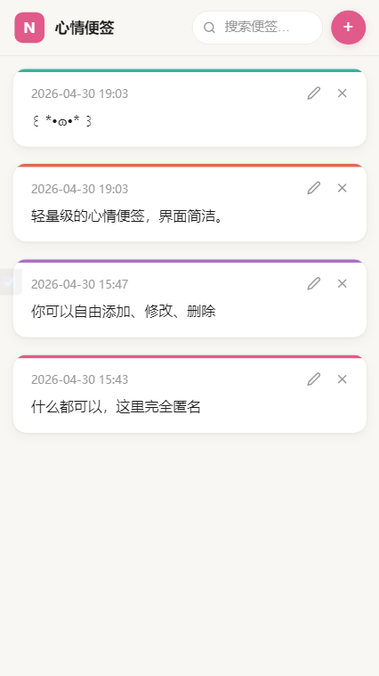
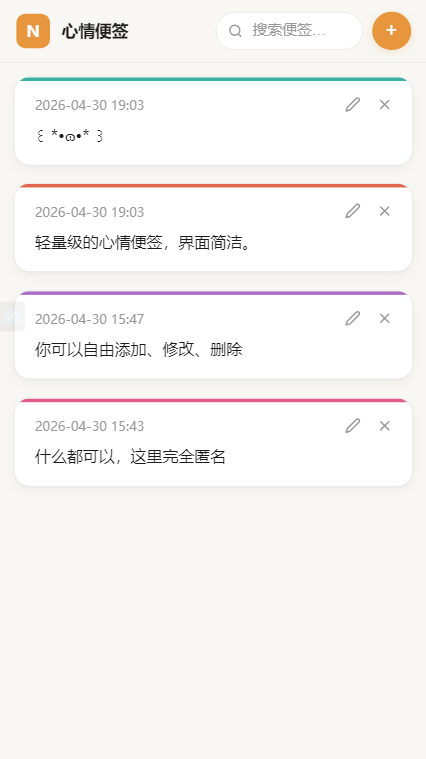
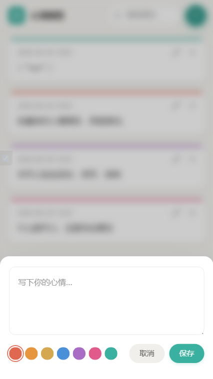

<div align="center">
<h1> 心情便签 </h1>

<p align="center">
  
</p>


<p align="center">
轻量级的心情便签 Web 应用，界面简洁，安全可靠，零依赖。
</p>
</div>


[[English]](README_en.md) · [简体中文]

## 预览 

[点击预览](https://handsome.eu.org/mood_notes/index.php)

<table>
  <tr>
    <td align="center">
      
    </td>
    <td align="center">
      
    </td>
    <td align="center">
      
    </td>
  </tr>
</table>

## 特性

- 新建、编辑、删除、搜索便签
- 7 种便签颜色可选
- 每次刷新随机主色调
- 全端适配，手机端底部弹窗编辑
- 无框架、无构建工具、无 npm

## 环境要求

- PHP 7.4+
- MySQL 5.7+
- Web 服务器（Nginx、Apache、Caddy 等均可）

## 快速开始

### 1. 克隆

```bash
git clone https://github.com/mmmlllnnn/mood-notes.git
cd mood-notes
```

### 2. 导入数据库

```bash
mysql -u root -p mood_notes < schema.sql
```

### 3. 配置

编辑 `config.php`：

```php
return [
    'db_host'    => 'localhost',
    'db_name'    => 'mood_notes',
    'db_user'    => 'your_user',
    'db_pass'    => 'your_password',
    'db_charset' => 'utf8mb4',
];
```

### 4. 部署

将所有文件复制到网站根目录，确保 Web 服务器能正确将请求路由到 `index.php`，并禁止直接访问 `config.php` 和 `schema.sql`。

Apache 用户：项目自带 `.htaccess`，自动处理安全规则。

Nginx 用户：需手动添加：

```nginx
location ~ (config\.php|schema\.sql|\.htaccess) {
    deny all;
}
```

### 5. 访问

```
http://你的服务器/
```

## 项目结构

```
├── index.php        前端页面
├── api.php          REST API 后端
├── config.php       数据库配置
├── schema.sql       建表脚本
├── .htaccess        Apache 安全规则
└── README_zh.md
```

## 自定义

颜色和主色调可在 `index.php` 顶部的配置区修改：

```php
// 便签颜色（需与 api.php 中 ALLOWED_COLORS 保持一致）
$noteColors = ['#e06850', '#e8963e', '#d4a84e', '#4a90d9', '#a86cc4', '#e05a8a', '#3ab0a0'];

// 主色调候选（每次刷新随机选一个）
$accents = $noteColors;
```

## API

所有响应均为 JSON 格式。

| 方法 | 路径 | 说明 |
|------|------|------|
| GET | `/api.php` | 获取所有便签 |
| POST | `/api.php` | 新建便签 |
| PUT | `/api.php?id=<uuid>` | 更新便签 |
| DELETE | `/api.php?id=<uuid>` | 删除便签 |

POST/PUT 请求体：

```json
{
  "content": "便签内容",
  "color": "#e06850"
}
```

## 安全

| 威胁 | 防护措施 |
|------|---------|
| SQL 注入 | PDO 预处理语句 |
| XSS | 所有用户输入通过 `textContent`/`innerHTML` 转义，API 返回纯 JSON |
| CSRF | HMAC 签名 token 嵌入页面，通过 `X-Api-Key` header 验证 |
| 文件直连 | 服务器禁止访问 `config.php`、`schema.sql` 及隐藏文件 |

## 开源协议

[MIT](LICENSE)
